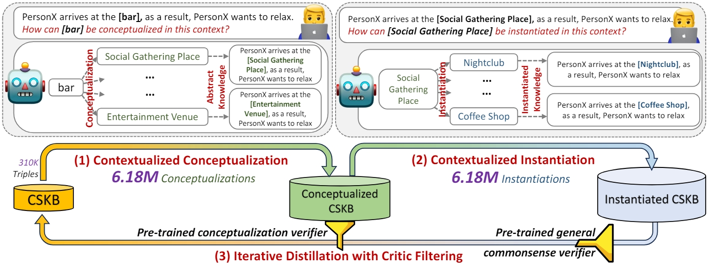

# CANDLE: Iterative Conceptualization and Instantiation Distillation from Large Language Models for Commonsense Reasoning

This is the official code and data repository for the [ACL2024](https://2024.aclweb.org/) (Main Conference) paper:
[CANDLE: Iterative Conceptualization and Instantiation Distillation from Large Language Models for Commonsense Reasoning](https://arxiv.org/abs/2401.07286).



## 1. Download Dataset/Model Checkpoints

Distilled conceptualizations and instantiations, based on the ATOMIC and AbstractATOMIC datasets, and model checkpoints
for all downstream tasks, can be downloaded
at [this link](https://hkustconnect-my.sharepoint.com/:f:/g/personal/wwangbw_connect_ust_hk/EqhEyfccW45HtyehVTDO_cgB9A2X4TQQKdeVnjqK1wMgng).

## 2. Distilling with CANDLE

The code for distilling conceptualizations with ChatGPT is `CANDLE_Distillation/ChatGPT_conceptualization.py`, and the
code for distilling instantiations with GPT-3 is `CANDLE_Distillation/LLAMA2_instantiation.py`.

Replace the OpenAI key and the HuggingFace Hub key with your own ones in the code to execute the distillation process.

## 3. Training Downstream Models
For the CSKB Conceptualization and the COMET tasks, please refer to [this repository](https://github.com/HKUST-KnowComp/CAT).
To train LLAMA2 for the COMET task, we use the code from the [LLaMA-Factory](https://github.com/hiyouga/LLaMA-Factory).

For zero-shot Commonsense QA task, please refer to [this repository](https://github.com/HKUST-KnowComp/CAR).

## 4. Citing this work

Please use the bibtex below for citing our paper:

```bibtex
@inproceedings{CANDLE,
  author       = {Weiqi Wang and
                  Tianqing Fang and
                  Chunyang Li and
                  Haochen Shi and
                  Wenxuan Ding and
                  Baixuan Xu and
                  Zhaowei Wang and
                  Jiaxin Bai and
                  Xin Liu and
                  Jiayang Cheng and
                  Chunkit Chan and
                  Yangqiu Song},
  title        = {{CANDLE:} Iterative Conceptualization and Instantiation Distillation
                  from Large Language Models for Commonsense Reasoning},
  year         = {2024},
  booktitle    = {Proceedings of the 62nd Annual Meeting of the Association for Computational Linguistics, {ACL} 2024}
}
```

## 5. Acknowledgement

The authors of this paper were supported by the NSFC Fund (U20B2053) from the NSFC of China, the RIF (R6020-19 and
R6021-20), and the GRF (16211520 and 16205322) from RGC of Hong Kong. We also thank the support from the UGC
Research Matching Grants (RMGS20EG01-D, RMGS20CR11, RMGS20CR12, RMGS20EG19, RMGS20EG21, RMGS23CR05, RMGS23EG08).
